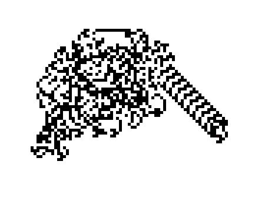

# langtonsant
No help from Shiffman on this one other than pointing me to the Wikipedia page for the two rules of the "game."
  Makes an ant walk around the grid, turning according to the color of the square it's on. Simple! Surprisingly hard to code right. 
 

